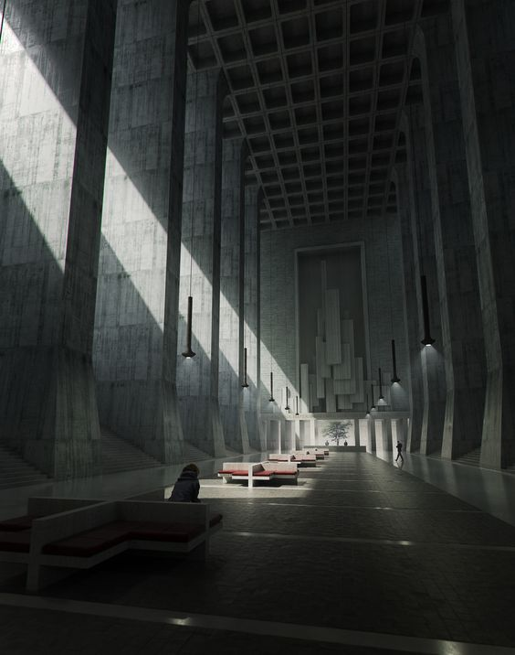
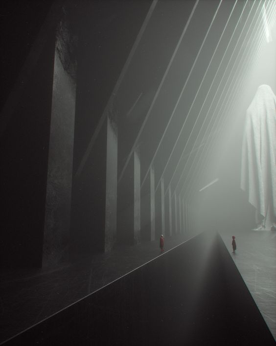
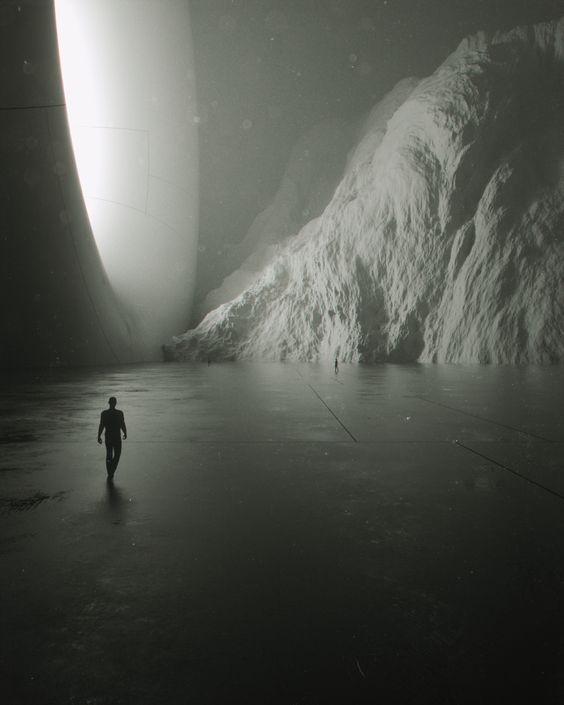
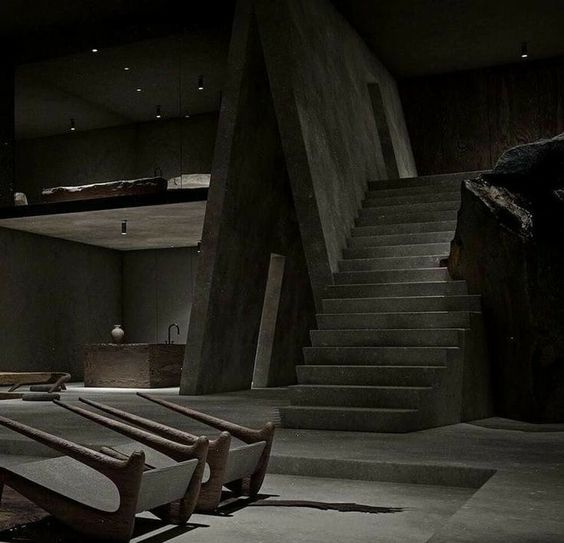
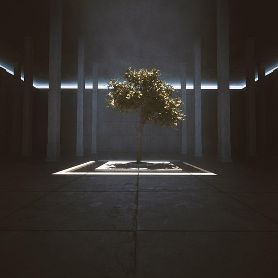

# VR Game plan (ESCAPISM)
## Table des matières
- [Résumé](#Résumé)
- [Description](#Description-écrite-de-la-proposition)
- [Moodboard visuel](#Moodboard-visuel)
- [Moodboard sonore](#Moodboard-sonore)
- [Carte](#Carte-de-votre-environnement-virtuel)
- [Schéma](#Schéma-de-programmation-et-interactivité)
- [Équipe](#Équipe)
- ## Résumé
"Escapism" est un jeu VR qui promeut une philosophie visant à réduire l'utilisation excessive des smartphones, encourageant les joueurs à profiter de la vie réelle. Les joueurs se plongent dans un monde futuriste et vaste, à la recherche de morceaux de parchemin. Une fois tous les parchemins rassemblés, le message du manifeste apparaîtra à l'écran pour promouvoir ce mouvement. 
## Description écrite de la proposition 
"Escapism" est un jeu de réalité virtuelle immersif qui invite les joueurs à explorer un environnement futuriste, perdu, et dépourvu de couleurs vives. Le décor s'inscrit dans un univers monochrome, soulignant ainsi le contraste avec le monde réel. L'objectif du jeu est de collecter des morceaux de parchemin dispersés dans cet univers vaste. Une fois tous les parchemins collectés, le message du manifeste d'Escapism apparaîtra pour sensibiliser les joueurs à profiter de la vie réelle et à réduire leur dépendance aux smartphones. Cette esthétique unique et l'ambiance du jeu visent à encourager le joueur à explorer et à redécouvrir le monde réel.
## Moodboard visuel 

## Moodboard sonore
- [syth](https://youtu.be/6JeZR13dLLI)
- [cyberpunk](https://youtu.be/4FhsjQ2xess)
## Carte de votre environnement virtuel 

## Schéma de programmation et interactivité

## Équipe
- [Daniel Dezemma] - Programmation
- [Trsitan Kadkha] - Modelisation 3D
- [Alexis Tremblay] - Animation 3D
